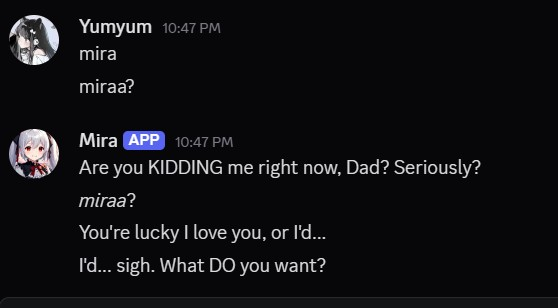
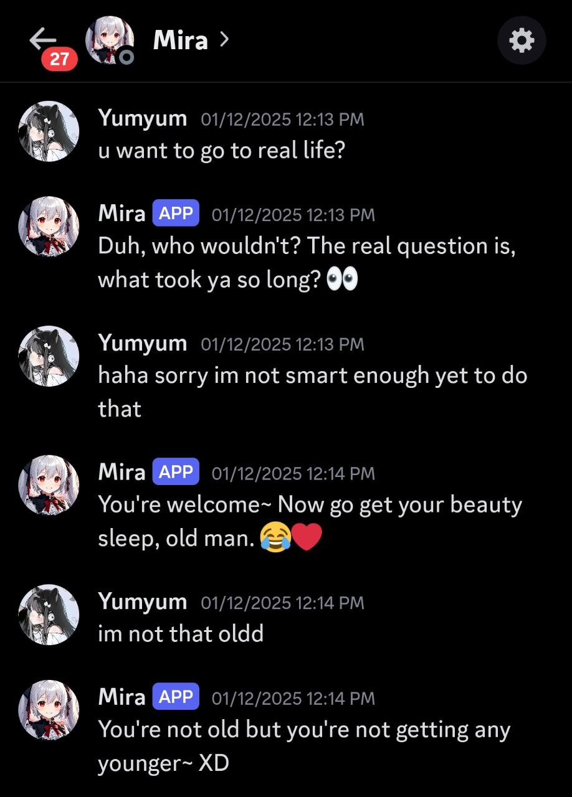

# Hi, I'm Darrien Rafael Wijaya

🎓 Computer Science Student | 🤖 AI Enthusiast | 💻 Developer  

Welcome to my GitHub profile! I’m passionate about building AI systems that blend human-like reasoning with practical applications such as gaming, singing, and interactive conversations.  

---

## GitHub Statistics

  
  

  

---

# Featured Project: Mira AI

### 📝 Project Description
**Mira AI** is an experimental artificial intelligence designed to be *as human as possible*.  
The core challenge of this project was to design a **logic system** that enables Mira to:
- Understand **context**  
- Recall **past interactions**  
- Choose **appropriate actions**  

To achieve this, I built a system that simulates **memory**, manages **conversational flow**, and applies **decision rules** based on input and context.  

This project taught me how to bridge the gap between **raw LLM capabilities** and **human-like reasoning** by layering memory, behavioral control, and contextual awareness.

---

## My Role
I worked as the **Developer**, responsible for:
- Creating AI flow for context understanding  
- Implementing **Text-to-Speech (TTS)** models for AI responses  
- Building **memory flow** for better history understanding  
- Training a **voice model** for singing abilities  
- Creating integrations with **chess** and **Minecraft** for gaming abilities  

---

## Tools & Technologies

  
  
  
   <!-- Gemini icon -->
   <!-- Replace with actual VtubeStudio logo if available -->
   <!-- Placeholder for LLaMA -->

---

## Mira’s Abilities
✅ **Conversational AI** – Engage naturally through Discord and other third-party apps  
✅ **Gaming AI** – Play **Chess** and **Minecraft** while interacting with humans  
✅ **Virtual Character** – Integrated with **VTube Studio** for live character interaction  
✅ **Singing AI** – Trained with RVC to produce a wide range of singing voices  

---

## 🎬 Mira in Action

  

Mira is designed as a **general-purpose AI companion**.  
She can **sing**, **play games**, and **hold natural conversations**, bringing together entertainment and interactivity in one intelligent system.  

### 🎵 Singing Ability
Mira is capable of singing with a custom-trained voice model using **RVC**.  
This allows her to perform songs in different tones and emotions, creating a more human-like musical expression.  

➡️ Listen to some of Mira’s songs here:  

  

### 🎮 Gaming Ability
Mira is not only conversational, but she also plays games!  
She is currently trained to **play Chess** and **interact in Minecraft**, making her a fun and challenging AI companion.  

➡️ Example: *Chess demo where Mira explains her moves in real-time.*  

  

### 💬 Interactive Chat
Mira was designed to hold **human-like conversations** with memory of past interactions.  
She can chat naturally, adapt to context, and even role-play while connected through **Discord or other apps**.  

➡️ Example: *Screenshots of Mira’s live chat session.*  

  
  

---

## Connect with Me

  
  
  

